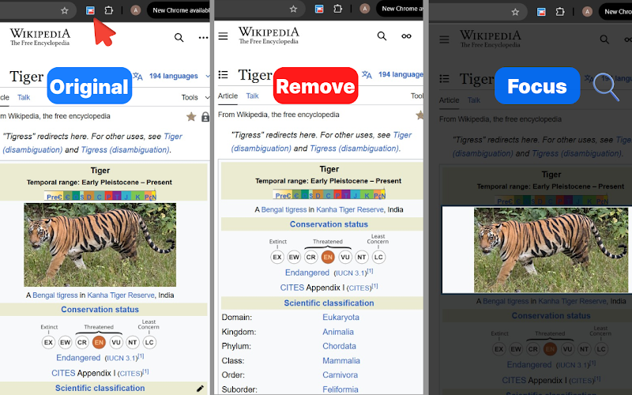
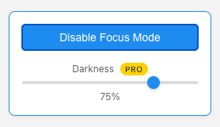
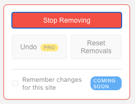

# Focus Web

**Focus Web** is a Chrome extension that helps you read and browse the web with fewer distractions. Point at any part of a page—an article, an image, a sidebar—and either **highlight it** while everything else fades away, or **remove** clutter permanently for the current session.

> Manifest name: **FocusWeb – Remove Webpage Distractions**

---

## Why Focus Web?

News sites, wikis, and dashboards pack a lot onto one screen. Focus Web gives you two simple tools:

| Mode | What it does |
|------|----------------|
| **Focus Mode** | Dims the rest of the page so only the element you choose stays clear and readable. |
| **Remove Elements** | Hides distracting blocks (ads, sidebars, banners) so the layout reflows without them. |

Only one mode runs at a time. Turning on Focus Mode turns off Remove mode (and vice versa).

---

## How it works (visual overview)

1. Open any normal webpage (**Original**).
2. Click the Focus Web icon in the toolbar and choose a mode.
3. Move your mouse—elements under the cursor get an outline. **Click** the one you want.



- **Remove** — The selected block disappears; the page layout adjusts.
- **Focus** — A dark overlay covers the page except for a “window” around your chosen element.

---

## Focus Mode

### Using Focus Mode

1. Open the extension popup and click **Enable Focus Mode**.
2. Hover over page elements. They highlight with a **blue** outline.
3. **Click** an element to focus it. Everything else is covered by a semi-transparent dark overlay.
4. **Click outside** the focused element to clear the spotlight and pick another target.
5. Click **Disable Focus Mode** in the popup when you are done.

### Popup controls



| Control | Description |
|---------|-------------|
| **Enable / Disable Focus Mode** | Turns selection and overlay behavior on or off for the current tab. |
| **Darkness** (Pro) | Slider from 10% to 95% for overlay strength (default **75%**). Updates live while Focus Mode is active. |

The overlay is a full-screen layer with a **clip-path** cutout aligned to the focused element’s bounds, so the chosen region stays bright and interactive.

---

## Remove Elements mode

### Using Remove mode

1. In the popup, click **Remove Elements**.
2. Hover to see a **red** outline on the element under your cursor.
3. **Click** to remove that element from view for this page load.
4. Repeat for other distractions, then click **Stop Removing** when finished.

Clicks are intercepted in remove mode so you do not accidentally follow links or trigger buttons while selecting.

### After you remove something



| Control | Description |
|---------|-------------|
| **Stop Removing** | Exits remove mode; removed elements stay hidden until you reset or refresh. |
| **Reset Removals** | Restores every element you removed on this tab. |
| **Undo** (Pro) | Reverts only the **last** removal. |
| **Remember changes for this site** | Planned feature (**Coming Soon**) — persist removals per domain across visits. |

Removed elements are hidden with CSS (`display: none` / `visibility: hidden`), not deleted from the DOM, so **Reset** and **Undo** can bring them back without reloading.

---

## Focus Web Pro

Some controls are marked **Pro** in the UI:

- **Darkness** — Custom overlay intensity in Focus Mode.
- **Undo** — Step back one removal at a time.

Pro availability is controlled in the extension configuration (`src/config.js`). Free users still get Focus Mode at the default darkness and can remove elements with **Reset Removals**.

---

## Permissions & privacy

Focus Web uses [Manifest V3](public/manifest.json) with:

- **`activeTab`** — Act on the tab you are viewing when you use the popup.
- **`scripting`** — Inject the content script if it is not already running.
- **`<all_urls>`** — Run on any site you choose to use the extension on.

The extension does not describe a remote analytics or sync service in this repository. Page changes (focus overlay, hidden elements) happen **locally in your browser** for the current tab session.

---

## Install from source

### Requirements

- [Node.js](https://nodejs.org/) (LTS recommended)
- Google Chrome or a Chromium-based browser

### Build

```bash
npm install
npm run build
```

The loadable extension is output to the **`build/`** folder.

### Load in Chrome

1. Open `chrome://extensions`.
2. Enable **Developer mode**.
3. Click **Load unpacked** and select the **`build`** directory.
4. Pin **Focus Web** from the extensions menu for quick access.

If a page was open before you installed or updated the extension, refresh it once before using Focus or Remove mode.

---

## Development

| Path | Role |
|------|------|
| `src/App.jsx` | Popup UI (React); sends messages to the active tab. |
| `public/content-scripts/focus.js` | Hover selection, focus overlay, remove/undo/reset logic. |
| `public/content-scripts/focus.css` | Hover outlines and hidden-element styles. |
| `public/manifest.json` | Extension metadata, permissions, content script registration. |
| `src/config.js` | Pro feature flags (`isSubscribed`). |

**Architecture (short):** The popup and content script communicate via `chrome.tabs.sendMessage`. The content script listens for actions such as `TOGGLE_FOCUS_MODE`, `TOGGLE_REMOVE_MODE`, `UPDATE_OPACITY`, `UNDO_REMOVAL`, and `RESET_REMOVALS`. On first use, the popup can inject `focus.js` and `focus.css` if messaging fails (e.g. restricted pages or a tab that loaded before the script).

```bash
npm run dev    # Vite dev server (popup UI only; test the full extension via build + Load unpacked)
npm run lint   # ESLint
```

Place extension icons at `public/focusExt-FinalLogo.png` (referenced by the manifest and popup).

---

## Tips

- **Focus then remove:** Disable Focus Mode, then use Remove Elements on the same page—you cannot run both modes simultaneously.
- **Heavy pages:** Very large DOM trees may make hover outlines jump between nested elements; click the container that best matches what you want.
- **Restricted pages:** Chrome blocks extensions on some URLs (e.g. the Web Store, `chrome://` pages). Use normal websites for testing.

---

## License

Copyright © 2025 FocusWeb Extension. All rights reserved.

If you publish this project on GitHub, add a `LICENSE` file and link it here.
